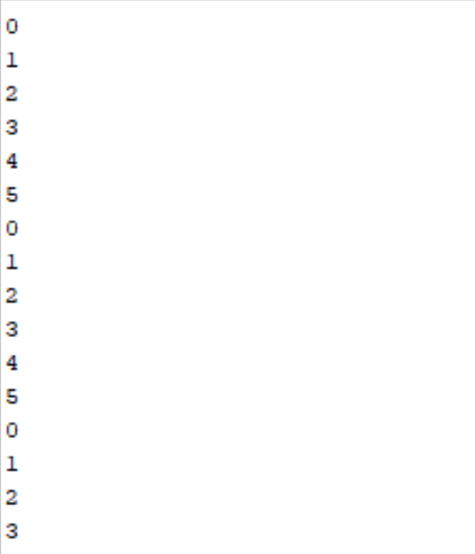

# Report Part 2

### Master

The ESP32 generates number from 0 to 5

### Slave

The Arduino will interprate the numbers sent and react :
- if 0 : the LED will light on for 200ms and light off 200ms
- if 3 : the LED will light on for 400ms and light off 400ms